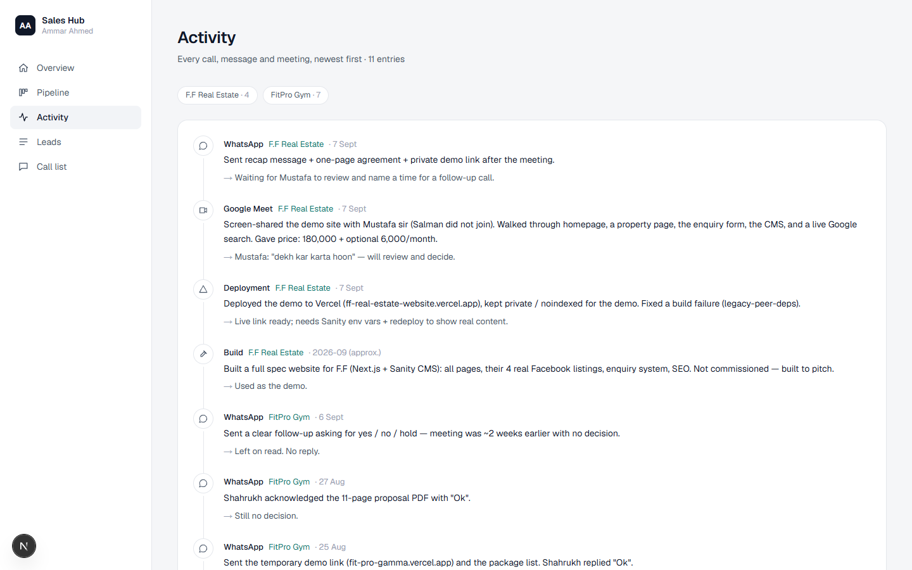
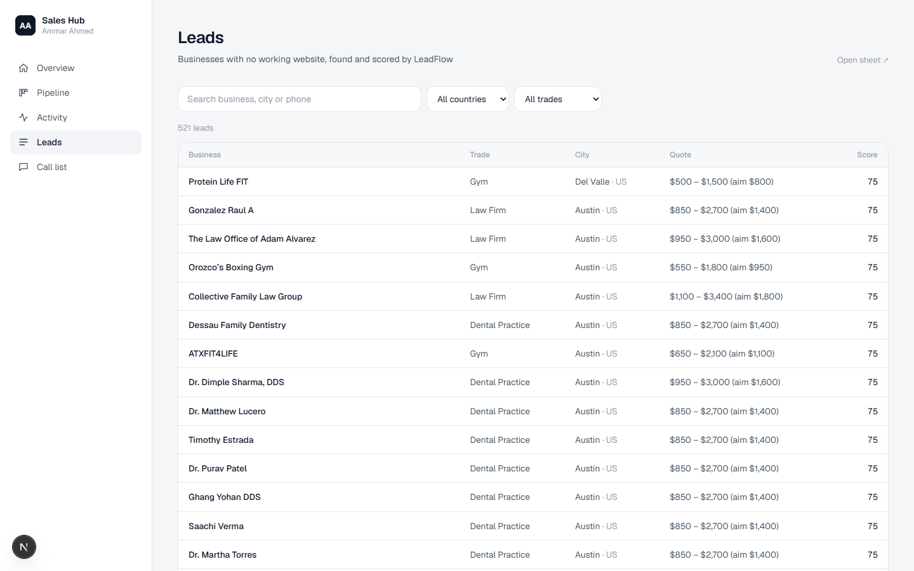
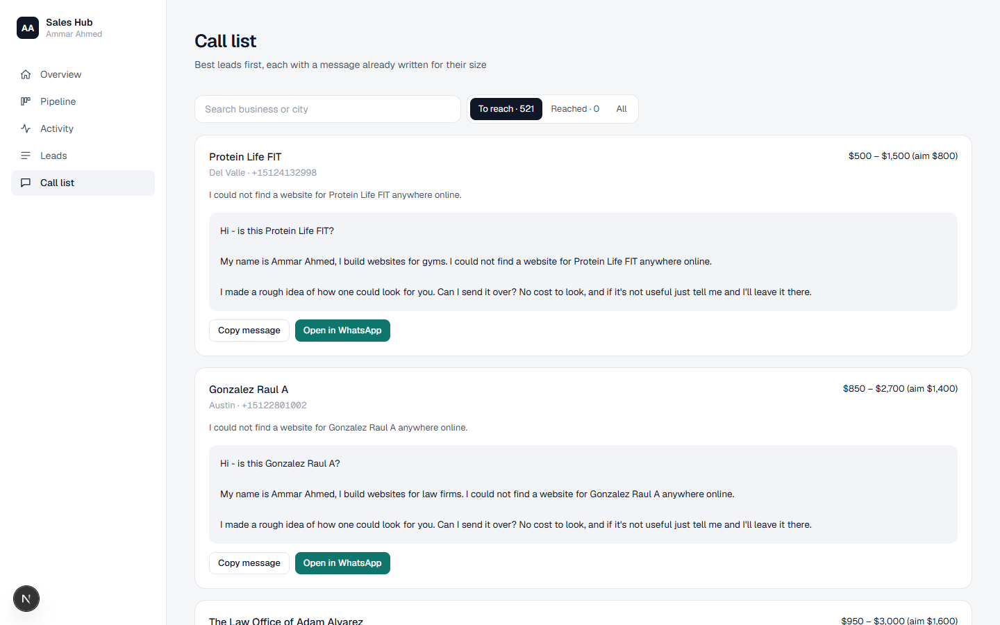
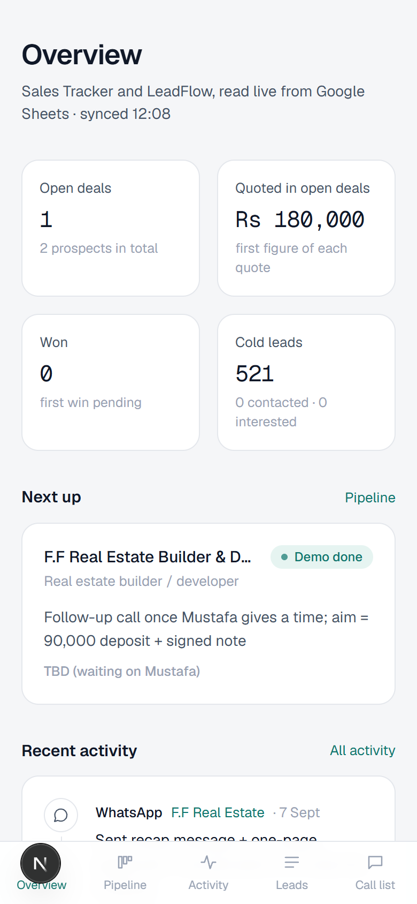

# Sales Hub

My sales operation in one place. Every prospect I'm talking to, every call and
message, and the cold-lead pipeline from [LeadFlow](https://github.com/ammarahmeddevv/leadflow)
— read live from Google Sheets and laid out so it's easy to scan on a laptop or
a phone.


## What's in it

- **Overview** — open deals, what's quoted, wins, and the cold-lead funnel;
  the next step on every open deal, sorted by date, with overdue ones flagged;
  the latest activity.
- **Pipeline** — a board of every prospect by stage.
- **Prospect pages** — the offer, the price, notes, one-tap Call and WhatsApp
  for each contact, and that prospect's full history.
- **Activity** — every call, message, meeting and build, newest first.
- **Leads** — the 500+ businesses LeadFlow found without a working website,
  searchable and filterable by country and trade.
- **Call list** — each lead's first message, already written to suit the size
  of the business, with Copy and Open-in-WhatsApp buttons.

## How it works

The Google Sheets are the source of truth — the Sales Tracker (prospects and
activity log) and the LeadFlow lead database. This app has no database of its
own: pages read the sheets server-side with a read-only Google service account
and refresh every 60 seconds, so a change in the sheet shows up here within a
minute.

- Rows are mapped by column header, not position, so reordering columns in the
  sheet doesn't break anything.
- Free-text stages ("Likely lost — no reply") are mapped onto a fixed set so
  they can be grouped and coloured; the original wording is kept.
- Requests to Google are retried on dropped connections. If the sheets can't be
  reached, pages say so instead of showing stale numbers.
- Kept out of search engines (`noindex` and a disallow-all `robots.txt`). An
  optional password gate switches on when `HUB_PASSWORD` is set.

## Screenshots

| Pipeline | Prospect |
| --- | --- |
|  |  |

| Activity | Leads |
| --- | --- |
|  |  |

| Call list | Mobile |
| --- | --- |
|  |  |

## Stack

Next.js 16 (App Router, server components) · TypeScript · Tailwind CSS v4 ·
Google Sheets API via a self-signed service-account JWT (no `googleapis`
dependency) · Vercel.

## Running locally

```bash
npm install
GOOGLE_APPLICATION_CREDENTIALS=path/to/service-account.json npm run dev
```

| Variable | Purpose |
| --- | --- |
| `GOOGLE_SERVICE_ACCOUNT_JSON` | Service-account key (inline JSON) — used on Vercel |
| `GOOGLE_APPLICATION_CREDENTIALS` | Path to the same key — handy locally |
| `TRACKER_SHEET_ID`, `LEADFLOW_SHEET_ID` | Override which spreadsheets are read |
| `HUB_PASSWORD` | Optional; turns on the password page |

## Licence

[MIT](LICENSE) © Ammar Ahmed
