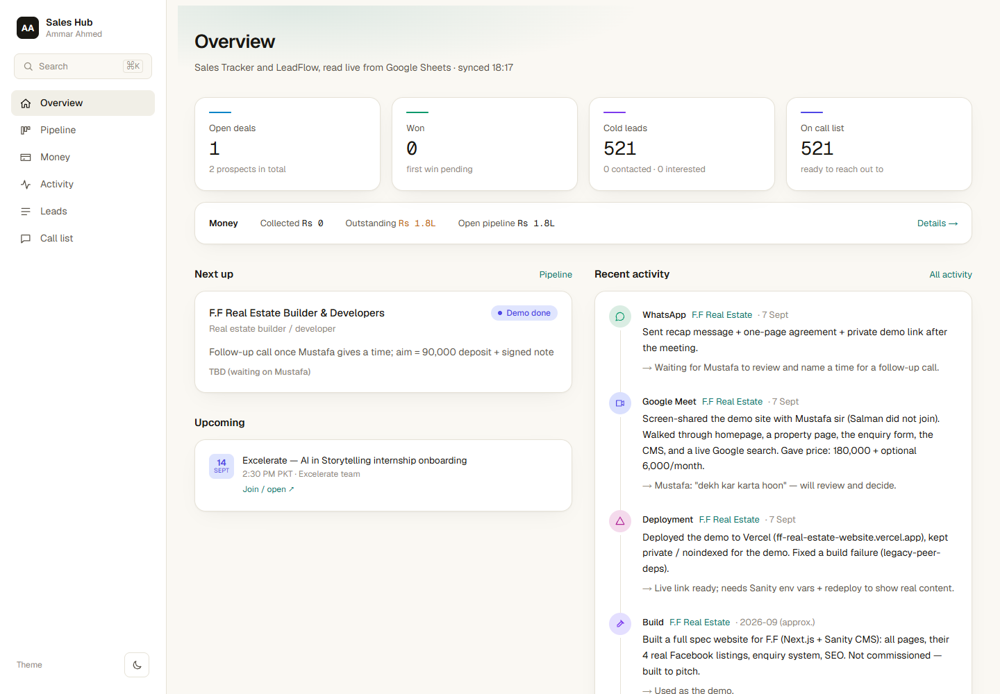
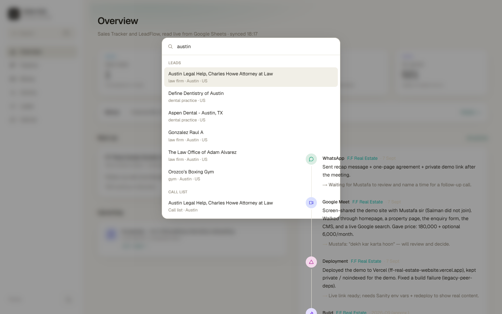
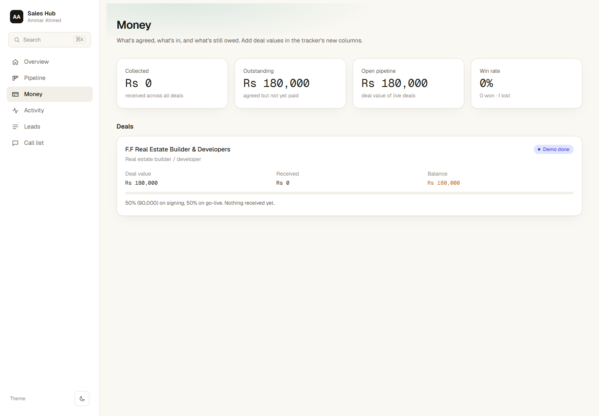
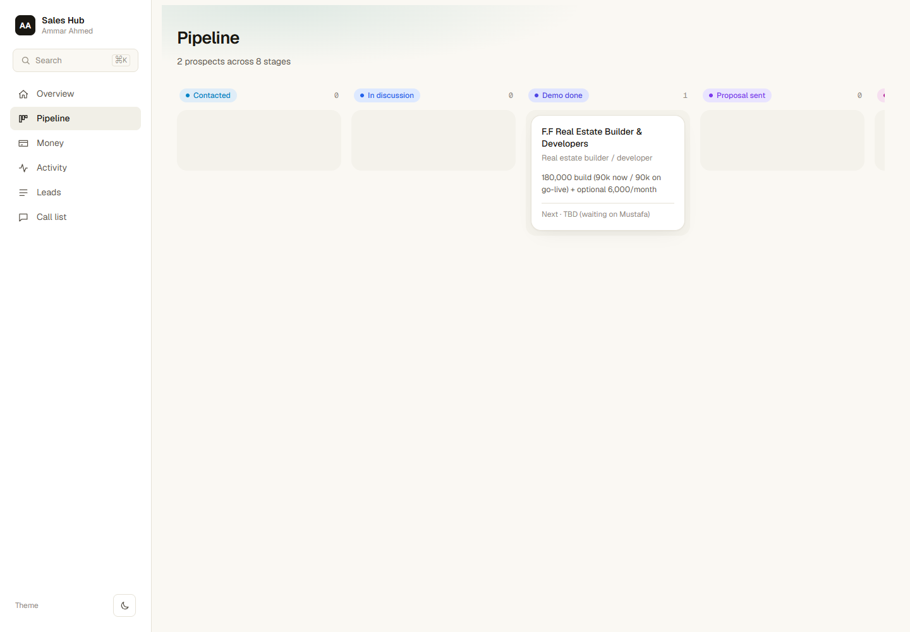
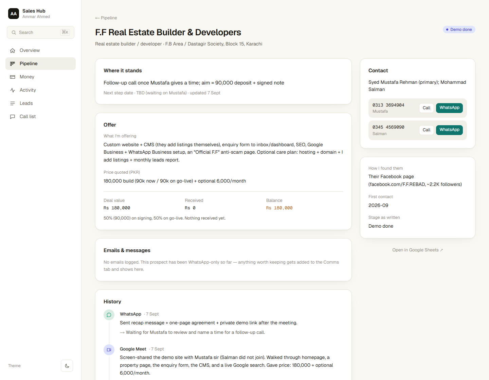
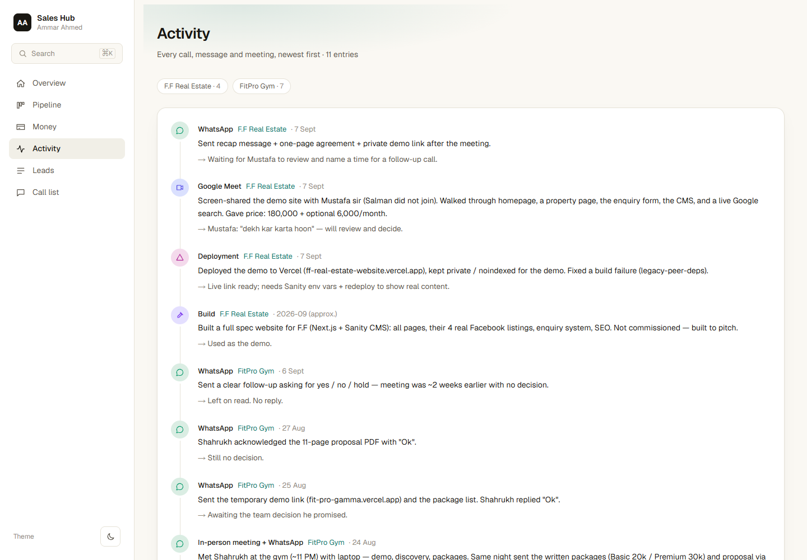
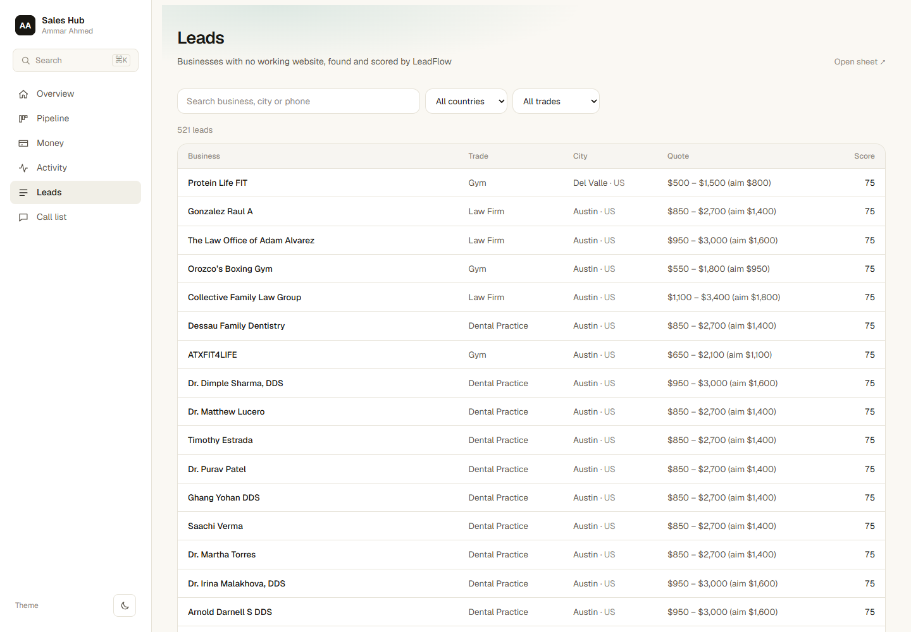
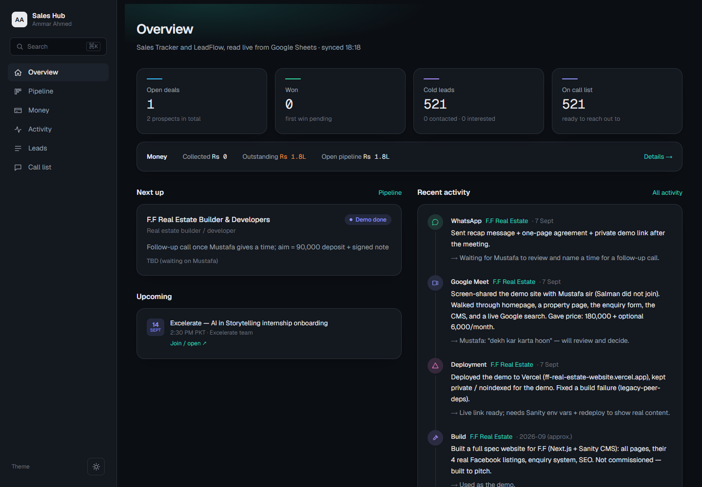
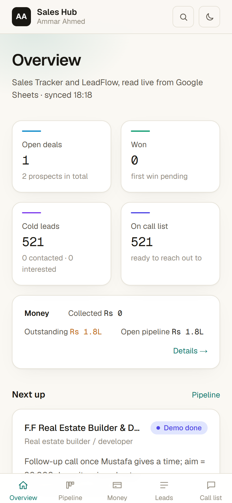

# Sales Hub

My sales operation in one place. Every prospect I'm talking to, every call and
message, the money in and owed, and the cold-lead pipeline from
[LeadFlow](https://github.com/ammarahmeddevv/leadflow) — read live from Google
Sheets and laid out so it's easy to scan on a laptop or a phone.



## What's in it

- **Overview** — open deals, a money strip, the cold-lead funnel, upcoming
  meetings, every open deal's next step sorted by date (overdue in red), and
  recent activity.
- **Global search** — ⌘K / Ctrl-K anywhere opens a command palette that
  searches across prospects, leads, activity and the call list at once.
- **Pipeline** — every prospect on a board, grouped by stage, with a colour
  running from first contact through to won.
- **Money** — collected, outstanding, open-pipeline value and win rate, then
  per-deal value / received / balance with a progress bar.
- **Prospect page** — the offer, the price, payment status, scheduled
  meetings, logged emails and messages, full history, and one-tap Call /
  WhatsApp for each contact.
- **Activity** — every call, message and meeting, newest first.
- **Leads** — the 500+ businesses LeadFlow found without a working website,
  searchable and filterable by country and trade.
- **Call list** — each lead's ready-written first message, with Copy and
  Open-in-WhatsApp buttons.
- **Light and dark themes**, with a toggle that remembers your choice, and a
  stage colour spectrum that runs through both.

## How it works

The Google Sheets are the source of truth — the Sales Tracker (prospects,
activity log, deal values) and the LeadFlow lead database. This app keeps no
database of its own: pages read the sheets server-side with a read-only Google
service account and refresh every 60 seconds, so a change in the sheet shows up
here within a minute.

- Rows are mapped by column header, not position, so reordering columns in the
  sheet doesn't break anything.
- Free-text stages ("Likely lost — no reply") are mapped onto a fixed set for
  grouping and colour; the original wording is kept.
- Meetings come from a `Calendar` tab and logged emails/messages from a `Comms`
  tab in the tracker, each linked to a prospect by name.
- Requests to Google are retried on dropped connections. If the sheets can't be
  reached, pages say so instead of showing stale numbers.
- Kept out of search engines (`noindex` + a disallow-all `robots.txt`). An
  optional password gate switches on when `HUB_PASSWORD` is set.

## Screenshots

| Global search (⌘K) | Money |
| --- | --- |
|  |  |

| Pipeline | Prospect |
| --- | --- |
|  |  |

| Activity | Leads |
| --- | --- |
|  |  |

| Dark theme | Mobile |
| --- | --- |
|  |  |

## Stack

Next.js 16 (App Router, server components) · TypeScript · Tailwind CSS v4 ·
Google Sheets API via a self-signed service-account JWT (no `googleapis`
dependency) · Vercel.

## Running locally

```bash
npm install
GOOGLE_APPLICATION_CREDENTIALS=path/to/service-account.json npm run dev
```

| Variable | Purpose |
| --- | --- |
| `GOOGLE_SERVICE_ACCOUNT_JSON` | Service-account key (inline JSON) — used on Vercel |
| `GOOGLE_APPLICATION_CREDENTIALS` | Path to the same key — handy locally |
| `TRACKER_SHEET_ID`, `LEADFLOW_SHEET_ID` | Override which spreadsheets are read |
| `HUB_PASSWORD` | Optional; turns on the password page |

## Licence

[MIT](LICENSE) © Ammar Ahmed
